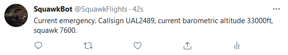

# TwitterSquawkBot
This bot reads in data from the OpenSky API and extracts the squawk code for each aircraft. It will then send out a tweet if any emergency squawk codes are detected.

The OpenSky API is a free api and as such it should not be heavily relied on. API timeouts can and will occur and the amount of aircraft tracked globally is significantly lower than other commercial APIs that exist.

# Files
Two files for this bot are included. Each uses a different way to pull data from the OpenSky API.

- mainAPI.py takes advantage of the package opensky_api to make calls to the api, so running this will require the package to be installed.
- mainWeb.py uses the web API at [https://opensky-network.org/api/](https://opensky-network.org/api/) and as such does not require the OpenSky API package to run.

An example of the tweet that this bot sends out is below.

